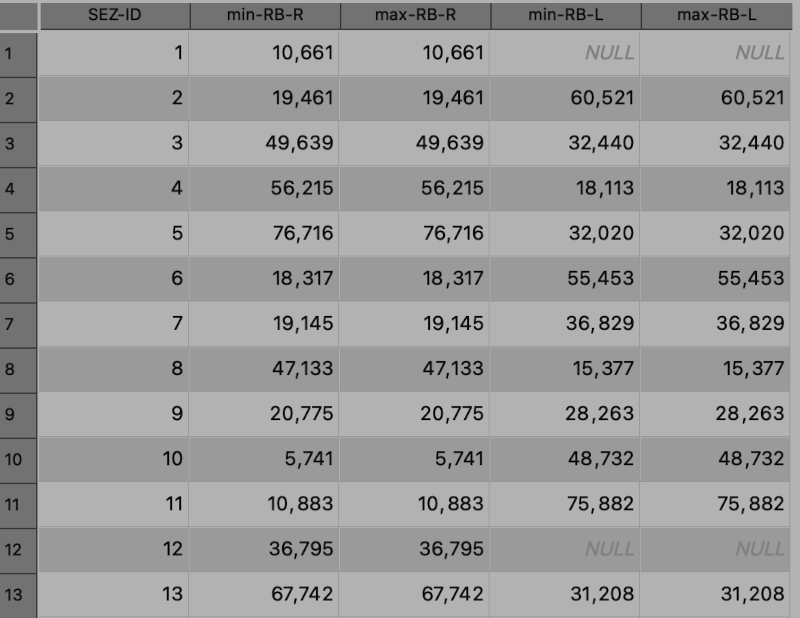

A simple tools for analysis of banks of a river in Qgis; algorytms and scripts are written with Qgis 3 graphical modeler and Python.

Page views 

## Table of content
1. [How to use on qgis](#how-to-use-on-qgis)
2. [Confined Valley Index](#confined-valley-index)
3. [Riverbanks Distance](#riverbanks-distance)
4. [Riverbanks Distance Comparison](#riverbanks-distance-comparison)
5. [Disclaimer and Credits](#disclaimer-and-credits)

-----------

## How to use on Qgis

Download the specific model3 files in this repository:
all model3 files are running on Qgis 3.28.11 or higher
- [Confined Valley Index](Models/CVI/Confined_Valley_Index_v.1.1.model3)
- [Riverbanks Distance](Models/RBD/River%20Banks%20Distance%20v.1.4.model3)
- [River Banks Distance Comparison](Models/RBDC/River%20Banks%20Distance%20Comparison%20v.1.4.model3)

NOTE: If you download file directly from GitHub webpage may assure that the extension of file must be .mopdel3 for properly use in Qgis

1. Open Qgis (developed and testet with Qgis 3.28.11)
2. Go to Processing sidebar and go to Model icon menu
3. Click on "Open existing model" and select the file in your filesystem

-------------

## Confined Valley Index
v. 1.1 (December 2023)

[DOWNLOAD PDF schema](Models/CVI/simplified-diagram/Confined_Valley_index_v.1.1.drawio.pdf)

### Description

The algorithm is used to calculate the relationship $C_{Vi}$ between the *width* of the ValleyBottom $VB_W$ and the *banks of a river* $RB_W$.

$$ C_{Vi} = {{VB_W} \over {RB_W}} $$

### Input data

| Parameter name    | Data Type     | Description                                                   |
|-------------------|---------------|---------------------------------------------------------------|
| LEFT River Bank   | _Vector Line_ | Line of the Left bank                                         |
| RIGHT River Bank  | _Vector Line_ | Line of the Right bank                                        |
| River Line        | _Vector Line_ | Path of the river                                             |
| Transects STEP    | Integer       | distance in meters along the path used for creating transects |
| Transects WIDTH   | Integer       | Lenght in meters of transects across river path               |
| Valley Bottom     | Polygon       | Polygon features that define the Valley Bottom of the river   |

Transects are generated, at constant distance from each other along the path, along the river axis; they intersect the right bank, the left bank and the ValleyBottom polygon. The distances between the river axis and the intersections are calculated,  the minimum value is taken. 

### Output

In Output a ***Vector Points*** along the river axis containing the calculated data is generated with this attribute table:

| Filed name    | Type  |    Desription                             |
|---------------|-------|-------------------------------------------|
| SEZ-ID        | Int   | Transect identifier (key field)           |
|**VB_RB-index**| Float | $C_{Vi} = {{VB_W} \over {RB_W}}$          |
| RB-W          | Float | Bank width                                |
| VB-W          | Float | ValleyBottom Width                        |
| min-RB-R      | Float | Minimum distance to the Right bank        |
| min-RB-L      | Float | Minimum distance to the Left bank         |
| min-VB-L      | Float | Minimum distance to the Left ValleyBottom |
| min-VB-R      | Float | Miminum distance to the Right ValleyBottom|
| transect_d    | Float | Progressive distance along river path     |

-----------------------

## Riverbanks Distance

--> [Download](Models/RBD/River%20Banks%20Distance%20v.1.4.model3) Qgis model3 file

### Description
distance between banks and axis of a river along path; useful for morphological analysis.

Centerline of the river is simplyfied into fixed-lenght segments,  for each step along the path this model get the distance between centerline and left/right banks.

Here how it works:

1. Create nodes along river centerline path,  using the input "step"
2. Assign a key-value for each nodes called "SEZ-ID"
3. Create a new simplified river centerline using nodes
4. Create transect across simplified river centerline
5. Make a spatial-join with transects and nodes and assign the key-value "SEZ-ID" to transects
6. Create nodes of intersection between Transects and banks (Left/Right)
7. Add coordinates X/Y of intersection into attribute table
8. Spatial join of intersection nodes and Transects, and then assign attribute
9. Calculation of distances (Left and Right) using attribute data
10. Field cleaning and output.

### Input data

| Parameter name        | Type          | Description                                                   |
|-----------------------|---------------|---------------------------------------------------------------|
| Left Riverbank - RB-L | Linestring    | Left bank vector, must contain 1-line feature                 |
| Right Riverbank - RB-R| Linestring    | Right bank vector, must contain 1-line feature                |
| River centerline      | Linestring    | Path of river                                                 |
| Step                  | Integer       | Distance in meters along river path from a node to another (*)|
| Transects width       | Integer       | Width in meters used to generate transects (**)               |

(*) A too short step increase computational resource needs and accuracy of data.
A too long step decrease accuracy of the output parameters that describe morphology of the river

(**) This value must be large enough, equal to at least twice the maximum distance at which the bank could be to intersect banks. It is used to generate transects orthogonal to the river simplified centerline

### Output

This model generate the ***Transects vector features*** along path of the river, and intersection nodes.
For each transect in attribute table there are Right and Left distance from centerline, useful to calculate banks width.

| Filed name    | Type  |    Description                            |
|---------------|-------|-------------------------------------------|
| SEZ-ID        | Int   | Transect identifier (key field)           |
| min-RB-R      | Float | Minimum distance to the Right Bank        |
| max-RB-R      | Float | Maximum distance to the Right Bank        |
| min-RB-L      | Float | Minimum distance to the Left Bank         |
| max-RB-L      | Float | Maxinum distance to the Left Bank         |

`null` value distance is for no intersection between transects and RB

This image is an example of map output.
linestring in red are the RB in input, the blue line is the river Centerline

## Riverbanks Distance Comparison

--> [Download](Models/RBDC/River%20Banks%20Distance%20Comparison%20v.1.4.model3) model3 file 

The bank distance comparison model (RBDC) is an implementation of RBD with two banks, which is useful in historical comparison analysis or quantitative analysis of the width of river banks in two epochs.

### Input data

| Parameter name                    | Type          | Description                                                   |
|-----------------------------------|---------------|---------------------------------------------------------------|
| River centerline                  | Linestring    | Path of river                                                 |
| Step                              | Integer       | Distance in meters along river path from a node to another (*)|
| Time 1 Left Riverbank - T1-RB-L   | Linestring    | Time 1 Left bank vector, must contain 1-line feature          |
| Time 1 Right Riverbank - T1-RB-R  | Linestring    | Time 1 Right bank vector, must contain 1-line feature         |
| Time 2 Left Riverbank - T2-RB-L   | Linestring    | Time 2 Left bank vector, must contain 1-line feature          |
| Time 2 Right Riverbank - T2-RB-R  | Linestring    | Time 2 Right bank vector, must contain 1-line feature         |
| Transects width                   | Integer       | Width in meters used to generate transects (**)               |
| Revert-path-direction             | Boolean       | if checked assignment order of "SEZ-ID" is reverted along path|

(*) A too short step increase computational resource needs and accuracy of data.
A too long step decrease accuracy of the output parameters that describe morphology of the river

(**) This value must be large enough, equal to at least twice the maximum distance at which the bank could be to intersect banks. It is used to generate transects orthogonal to the river simplified centerline

### Output

This model generate 2 layers:
1) a **line** layer called: "_T1-T2 Transects RB distance comparison_"
2) a **point** layer called: "_Interseciton nodes_"

Transects layer contain data about bank distance and their comparison, point layer contain only point of intersection between banks and transects.

The attribute table of Transects layer contain this data:

| Filed name        | Type  |    Description                                        |
|-------------------|-------|-------------------------------------------------------|
| SEZ-ID            | Int   | Transect identifier (key field)                       |
| T1-min-RB-R       | Float | Time 1 Minimum distance to the Right Bank: ${r}_{T1}$ |
| T1-max-RB-R       | Float | Time 1 Maximum distance to the Right Bank: ${R}_{T1}$ |
| T1-min-RB-L       | Float | Time 1 Minimum distance to the Left Bank: ${l}_{T1}$  |
| T1-max-RB-L       | Float | Time 1 Maxinum distance to the Left Bank: ${L}_{T1}$  |
| T2-min-RB-R       | Float | Time 2 Minimum distance to the Right Bank: ${r}_{T2}$ |
| T2-max-RB-R       | Float | Time 2 Maximum distance to the Right Bank: ${R}_{T2}$ |
| T2-min-RB-L       | Float | Time 2 Minimum distance to the Left Bank: ${l}_{T2}$  |
| T2-max-RB-L       | Float | Time 2 Maximum distance to the Left Bank: ${L}_{T1}$  |
| T2-T1-min-delta-L | Float | $\Delta_l$ = ${l_{T2}}$ - ${l_{T1}}$                  |
| T2-T1-min-delta-R | Float | $\Delta_r$ = ${r_{T2}}$ - ${r_{T1}}$                  |

`null` value distance is for no intersection between transects and RB

This is an example of results in attribute table

This is an example of results in maps

## Disclaimer and credits

This repository contains algorithms that for calculating and analyzing some hydrographic features that are useful for analyses on historical course trends and river geometry.

The work was developed within my research at the University of Catania as Phd student, specific through a Scientific collaboration agreement between the Basin Authority of the Hydrographic District of Sicily [(AdB Sicilia)](https://www.regione.sicilia.it/istituzioni/regione/strutture-regionali/presidenza-regione/autorita-bacino-distretto-idrografico-sicilia/contatti-dipartimento-autorita-bacino-adb) and the Department of Civil Engineering and Architecture [(DICaR)](https://www.dicar.unict.it) of the University of Catania, for hydrological and hydraulic studies for the identification of river belts, for the identification of NWRM (Natural Water Retention Measures), and for the definition of lamination plans of the rivers.

### List of contributors

- [Gianfranco Di Pietro](https://gianfrancodp.github.io), *PhD student at Università di Catania*
- [Rosaria Ester Musumeci](https://www.dicar.unict.it/faculty/rosaria.ester.musumeci), *Associate professor of Hydraulics - Università di Catania*
- Valeria Pennisi, *Researcher at Università di Catania*
- Martina Stagnitti, *Researcer at Università di Catania*